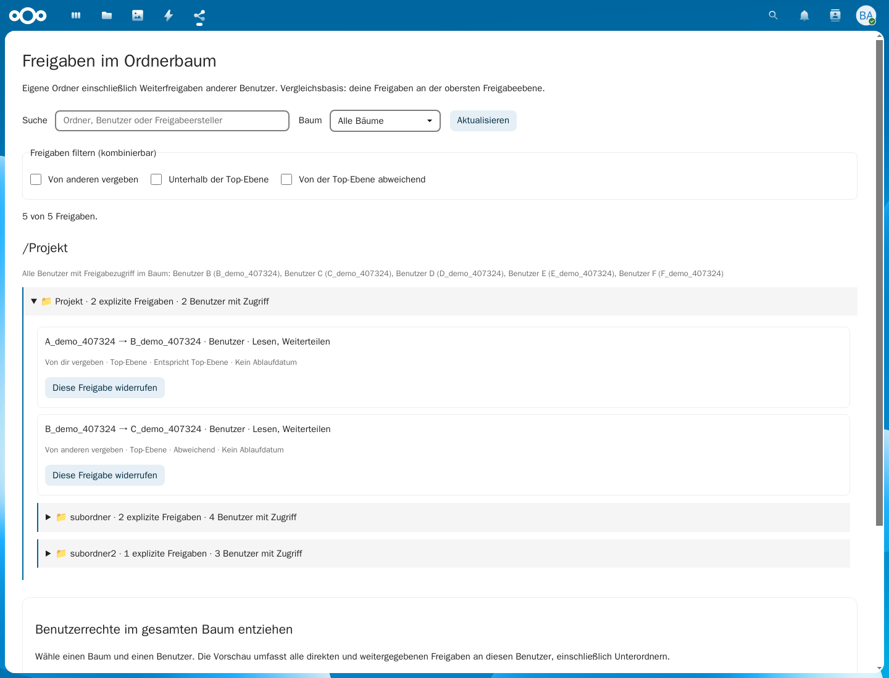
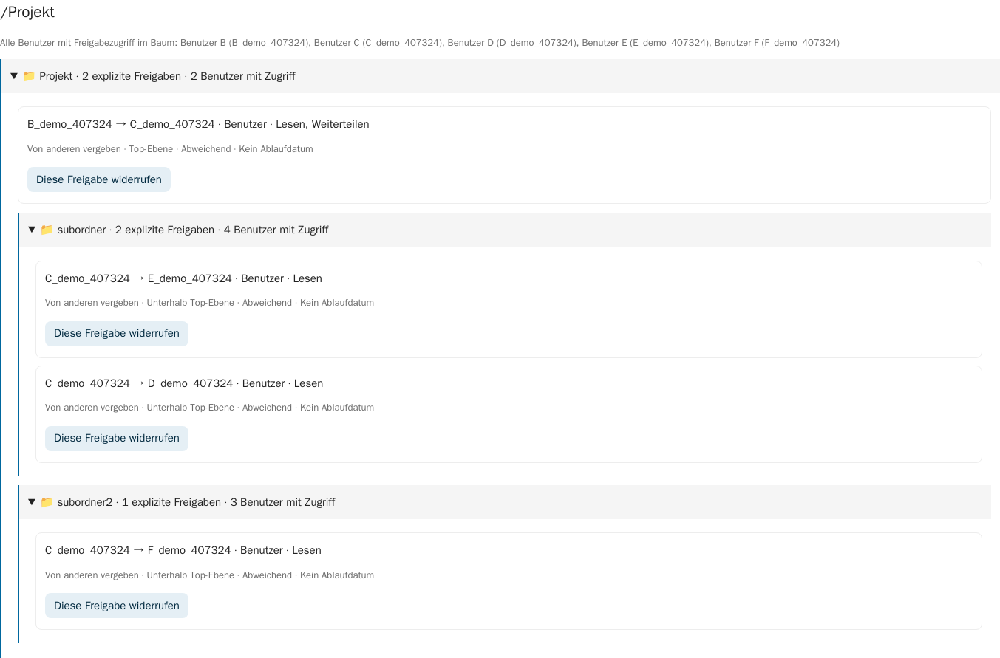
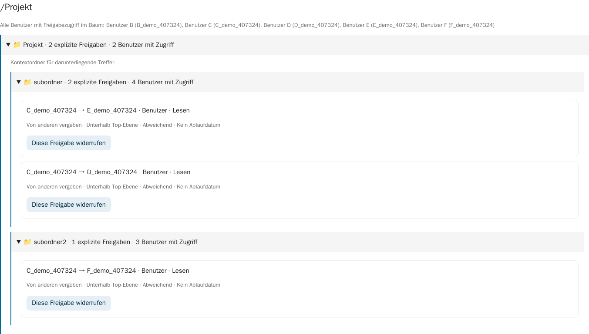
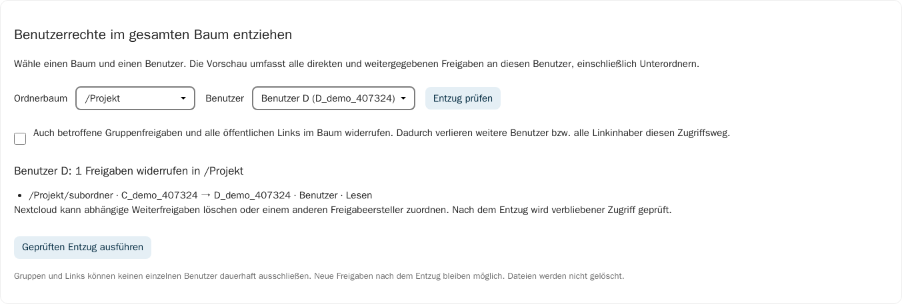
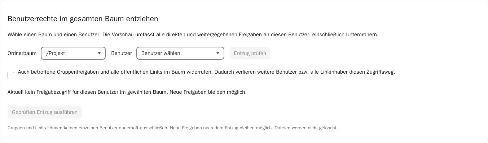

# Share Manager – Ordnerbaum und Rechteentzug

Version 0.2.0 · Nextcloud 33 · 7. Oktober 2026

Diese Anleitung zeigt echte Screenshots der App mit fiktiven Benutzern A–F. **A ist der Eigentümer** von `Projekt`. A teilt mit B, B teilt mit C weiter. C teilt `subordner` mit D und E und `subordner2` mit F. Die zusätzlichen Zeichen in den Benutzerkennungen gehören zur isolierten Demo.

## 1. Den gesamten Freigabebaum sehen

Öffne **Share Manager** im Nextcloud-App-Menü. Im Baum stehen alle eigenen geteilten Ordner einschließlich Weiterfreigaben anderer Benutzer. Über das Dreieck am Ordnernamen öffnest oder schließt du einen Zweig.

Die Benutzerübersicht oberhalb des Baums enthält **B, C, D, E und F**. Jede explizite Freigabe zeigt **Ersteller → Empfänger** und die Rechte. Unterordner zeigen zusätzlich die geerbten Freigaben aus ihren Eltern. Auch `Archiv` ohne eigene Freigabe gehört zum Baum.

Unter **Baum** kannst du einen bestimmten obersten geteilten Ordner auswählen. **Aktualisieren** lädt Freigaben, Gruppenmitgliedschaften und Ordner erneut.

## 2. Von anderen vergebene Freigaben filtern

Aktiviere **Von anderen vergeben**.

A sieht jetzt B → C und C → D/E/F. A → B wird ausgeblendet. Kontextordner bleiben sichtbar, damit Treffer ihren Platz im Tree behalten. Die fremden Freigaben sind für A als ursprünglichen Eigentümer verwaltbar.

## 3. Freigaben unterhalb der Top-Ebene finden

Aktiviere **Unterhalb der Top-Ebene**.

Der Filter zeigt explizite Freigaben auf Unterordnern oder Dateien. Im Beispiel sind das C → D/E auf `subordner` und C → F auf `subordner2`. B → C auf `Projekt` liegt dagegen auf der Top-Ebene.

Geerbte Rechte werden dabei nicht als neue Freigabestelle gezählt. Wenn B Zugriff auf `Projekt` hat, ist sein dadurch geerbter Zugriff auf `subordner` kein neuer Eintrag unterhalb der Top-Ebene.

## 4. Abweichungen erkennen und Filter kombinieren

Aktiviere **Von der Top-Ebene abweichend**.

Verglichen wird mit **den von A selbst vergebenen Freigaben am obersten geteilten Ordner**: Freigabeart, Empfänger, Rechte, Ablaufdatum und vorhandener Passwortschutz. Die Passwortwerte werden nicht ausgegeben oder miteinander verglichen.

Im Beispiel ist B → C bereits auf der Top-Ebene abweichend, weil A dort nur B berechtigt hat. D, E und F sind ebenfalls zusätzliche Empfänger. Eine Unterordnerfreigabe an B mit exakt gleichen Eigenschaften würde nur „Unterhalb der Top-Ebene“ treffen.

Alle drei Filter sind kombinierbar und werden mit **UND** verbunden. In **Suche** kannst du zusätzlich nach Ordner, Pfad, Empfänger oder Ersteller suchen. Leere das Suchfeld und entferne die Häkchen, um die vollständige Ansicht wiederherzustellen.

## 5. Benutzerrechte im gesamten Tree prüfen

Wähle unter **Benutzerrechte im gesamten Baum entziehen** den Baum `Projekt` und Benutzer D. Klicke **Entzug prüfen**.

Die Vorschau findet Freigaben an D unabhängig davon, wer sie vergeben hat. Sie umfasst den gesamten ausgewählten Baum, nicht nur die gerade sichtbaren Suchtreffer. Im Beispiel wird C → D auf `subordner` angezeigt. Hat D mehrere direkte oder weitergegebene Freigaben in diesem Baum, werden alle berücksichtigt.

**Gruppen und öffentliche Links:** D kann zusätzlich über Gruppenmitgliedschaften oder einen bekannten öffentlichen Link zugreifen. Ohne Zusatzwahl blockiert die App dann einen vollständigen Entzug. Die Zusatzwahl widerruft betroffene Gruppenfreigaben **für alle Gruppenmitglieder** sowie **alle öffentlichen Links im Baum für alle Linkinhaber**. Prüfe die Vorschau und die aufgeführten Gruppenmitglieder vor der Zustimmung. Die App entfernt niemanden global aus einer Gruppe.

Weitere nicht unterstützte Freigabearten oder nicht vollständig prüfbare Einbindungen blockieren den vollständigen Entzug.

## 6. Entzug ausführen und Ergebnis prüfen

Klicke **Geprüften Entzug ausführen** und bestätige den Browserdialog. Mit **Abbrechen** bleibt alles erhalten.

Vor der Änderung wird die Vorschau erneut geprüft. Haben sich Freigaben oder Gruppenmitgliedschaften geändert, musst du eine neue Vorschau laden. Nach dem Widerruf prüft die App tatsächliche Zugriffslisten und lädt den Baum erneut.

Im Beispiel hat D danach keinen aktuellen Freigabezugriff mehr in `Projekt`; E und F behalten ihre eigenen Freigaben. Dateien und Zugriffe außerhalb dieses Baums bleiben erhalten. Nextcloud kann abhängige Weiterfreigaben verändern oder einem anderen Ersteller zuordnen.

**Kein dauerhafter Ausschluss:** Neue Freigaben an D sind später wieder möglich. Bereits heruntergeladene Kopien werden nicht zurückgerufen. Eine direkte Rückgängig-Funktion gibt es nicht.

## 7. Fehler und Grenzen

- Bei einer geänderten Vorschau: **Entzug prüfen** erneut ausführen.
- Bei Teilfehlern: Die Meldung nennt bereits widerrufene Freigaben; kein ungeprüfter Erfolg wird behauptet. Lade Baum und Vorschau erneut.
- Nur der ursprüngliche Eigentümer darf den gesamten Baum verwalten. Empfänger erhalten keine globale Eigentümersicht.
- Ein Unterbaum mit außerhalb liegenden geerbten Freigaben ist kein zulässiger Bereich für den vollständigen Entzug; wähle die oberste Freigabeebene.
- Gruppenfreigaben, öffentliche Links und andere Berechtigungssysteme lassen sich nicht durch eine einzelne Benutzersperre in dieser App übersteuern.
- Fremde/eigentümerlose Einbindungen und mehr als 5000 Ordner bzw. Freigabestellen verhindern eine vollständige Auswertung.

Weitere technische Details und Installation stehen in der [README](../README.md).
